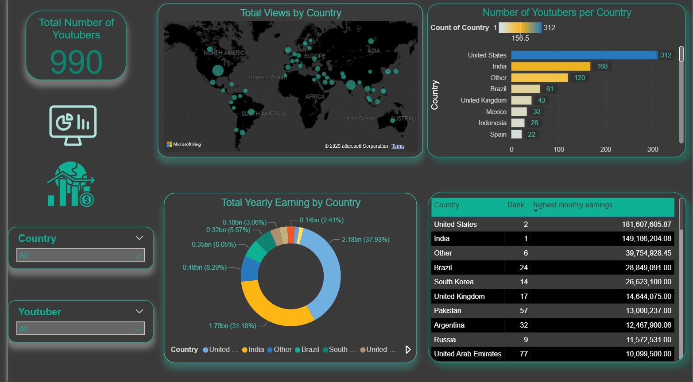
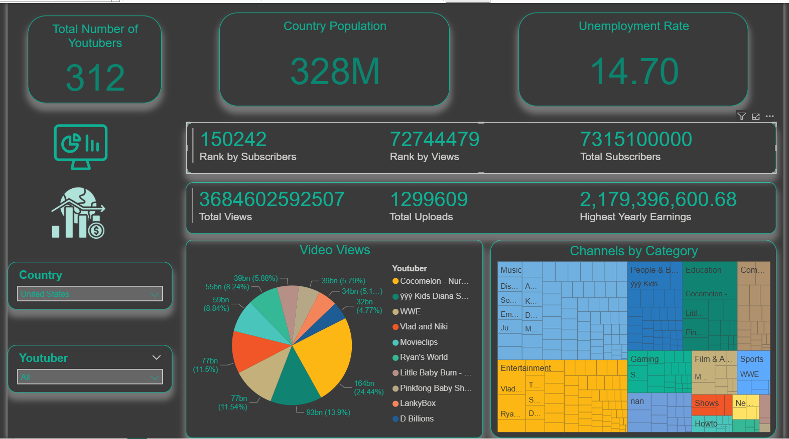

# Global YouTube Statistics Dashboard

  
  

Welcome to the Global YouTube Statistics Dashboard repository! This project features an in-depth and interactive Power BI dashboard designed to analyze and visualize key statistics of top YouTube creators worldwide. The dashboard provides valuable insights into viewership trends, top earners, and popular content categories across different countries.

## 🎥 Video Demonstration

For a complete tour and demonstration of the dashboard's interactive features, please watch the video below:

Watch the dashboard in action: [YouTube Demo Video](https://www.youtube.com/watch?v=ds_4qnGp6kQ)

## 📈 Key Features

### Interactive Visualizations

- Global Distribution Map: Geographic visualization of top YouTube channels by country
- Revenue Analysis: Earnings breakdown and monetization insights
- Subscriber Metrics: Channel growth and subscriber count analysis
- Content Category Performance: Performance comparison across different content types
- Upload Frequency Impact: Correlation between upload patterns and channel success

### Analytics Capabilities

- Real-time filtering and sorting options
- Cross-dimensional analysis tools
- Trend identification across multiple metrics
- Comparative performance analysis
- Statistical summaries and KPIs

## 🗂️ Data Source
**Dataset**: [Global YouTube Statistics 2023](https://www.kaggle.com/datasets/nelgiriyewithana/global-youtube-statistics-2023/data)

The dataset contains comprehensive information about top YouTube channels including:

- Channel names and subscriber counts
- Video views and upload frequency
- Earnings and monetization data
- Geographic distribution
- Content categories
- Channel creation dates
- Performance metrics

## 🛠️ Tech Stack
- #### Data Visualization & Analysis: Microsoft Power BI
- #### Data Cleaning & Transformation: Power Query

